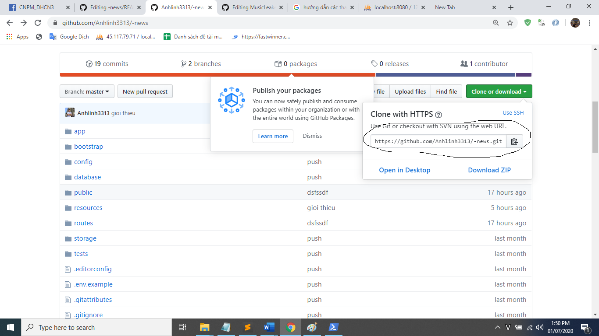
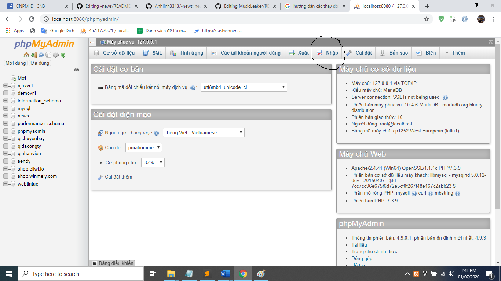
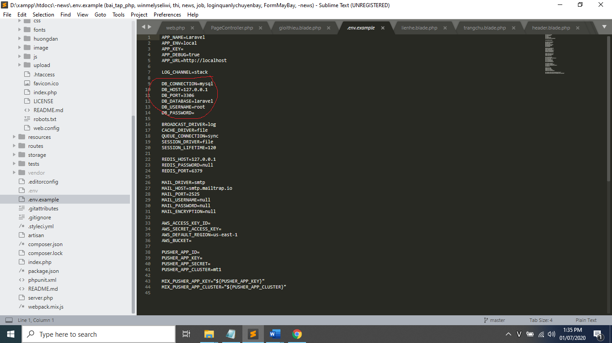
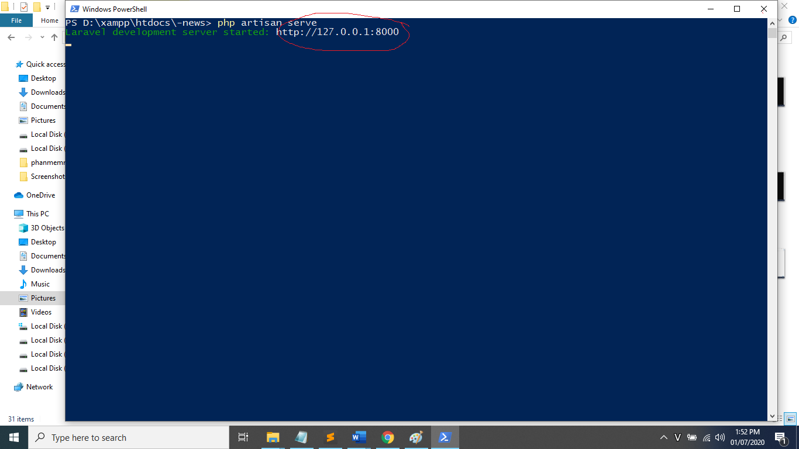

# website Xây dựng cổng thông tin thể thao Việt Nam

# Công dụng, ứng dụng
công dụng
  - thêm, sửa, xoá
  - login
  - xem tin, chọn tin
  
Ứng dụng
  - Áp dụng cho các nhóm nhỏ, tổ chức phi lợi nhuận trong việc chia sẻ thông tin miễn phí.
  - Những người yêu thích sự tiện lợi , nhanh chóng trong việc đọc thông tin hàng ngày

# Mục đích của bài toán
Đầu vào
  - Bao gồm các thể loại thông tin thể thao
  - Email, tài khoản, mật khẩu người dùng

Đầu ra
   - các mục lục menu chọn tin
   - các list view để người dùng thêm sửa xoá

# Các bước cài đặt
-Bước 1: Tước tiên bạn clone sourcecode về máy của mình https://github.com/Anhlinh3313/-news.git
  

-Bước 2: Sau khi clone về xong bạn vào thư mục laravel_demo.zip.

-Bước 3: Tiến hành bận Xampp.

-Bước 4: Vào trình duyệt mở localhost/phpmyadmin tiên hành nhập database.
  

-Bước 5: sau khi nhập xong bạn vào thư mục .env.example thay đổi thông số localhost của bạn và ten database.
   

-Bước 6: Nhấn tổ hợp phím shift+chuột phải chọn như hình.

-Bước 7: gõ lệnh php artisan serve để có link hiển thị loading trang http://127.0.0.1:8000.

-Bước 8: Vào google gõ http://127.0.0.1:8000/trangchu khi thao tác với trang giao diện
         gõ http://127.0.0.1:8000/admin/theloai/danhsach khi thao tác với trang admin
         
-Bước 9: Các link được hiển thị trong thư mục routes/web.php

# Nội dung của bài toán
- Bài toán cổng thông tin thể thao làm một bài toán đặc tả các thông tin thể thao với nhiều thể loại thể thao nhiều bộ môn thể thao khác nhau vì vậy có thể nói rằng nội dung chính muốn cho người dùng nắm rõ hơn về những thôn tin thể thao mỗi ngày mang tính chất cập nhật thời gian thực.

# Hướng phát triển cho bài toán
-Hiển thị phân loại tin, thể loại top những thông tin đứng đầu
-Tạo đanh nhập mật khẩu bằng zalo facebook hoặc một số mạng khác.
-Đăng nhập người dùng xác nhận mật khẩu bằng số điện thoại hoặc gmail
-Tạo sự trao đổi thông tin lẫn nhau dữ nhiều người dùng bằng cách hiển thị các comment của họ 
-phát triển thêm phần layout giao diện người dùng cũng như giao diện admin thêm phần hấp dẫn
-Tích hợp thêm khả năng chia sẽ từ trang thông tin đến các trang mạng xã hội

# Ngôn ngử sử dụng CSS,HTML,PHP,SCRIPT,NET FRAMEWORK LARAVEL

# Tác giả:
- Lê khả lĩnh.

